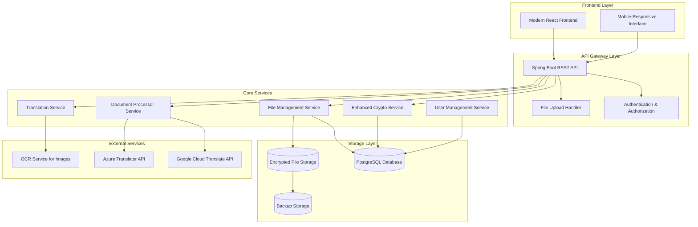

# Design Document: Enhanced KMS Platform

## Overview

The Enhanced KMS Platform transforms the existing Key Management System into a comprehensive secure document management and processing platform. The system will provide secure file storage with encryption, document format conversion, multi-language translation, and a modern web interface. The architecture maintains the existing cryptographic foundation while adding new capabilities for file management, document processing, and user experience enhancements.

## Architecture

### High-Level Architecture



### Technology Stack

**Backend:**
- Java 17+ with Spring Boot 3.x
- Spring Security for authentication
- Spring Data JPA with PostgreSQL
- Apache POI for document processing
- iText/OpenPDF for PDF operations
- Google Cloud Translate API
- Azure Translator API (fallback)

**Frontend:**
- React 18+ with TypeScript
- Material-UI or Ant Design for components
- React Router for navigation
- Axios for API communication
- React Query for state management

**Infrastructure:**
- Docker containers for deployment
- PostgreSQL for metadata storage
- File system or cloud storage for encrypted files
- Redis for session management and caching

## Components and Interfaces

### Enhanced Crypto Service

**Purpose:** Improved cryptographic operations with better error handling and consistency.

**Key Improvements:**
- Fixed decryption logic with proper error handling
- Consistent key derivation and validation
- Enhanced audit logging
- Backward compatibility with existing encrypted data

**Interface:**
```java
public interface EnhancedCryptoService {
    EncryptionResult encryptData(byte[] data, String userId);
    DecryptionResult decryptData(Long recordId, String userId, String clientPublicKey, String serverPublicKey);
    boolean validateKeys(String clientPublicKey, String serverPublicKey);
    void auditCryptoOperation(String operation, String userId, boolean success);
}
```

### File Management Service

**Purpose:** Secure file upload, storage, and retrieval with support for multiple file types.

**Capabilities:**
- Multi-format file support (images, videos, documents, text)
- Automatic file type detection and validation
- Virus scanning integration
- File size and quota management
- Metadata extraction and storage

**Interface:**
```java
public interface FileManagementService {
    FileUploadResult uploadFile(MultipartFile file, String userId);
    FileDownloadResult downloadFile(Long fileId, String userId);
    List<FileMetadata> listUserFiles(String userId, FileType type);
    boolean deleteFile(Long fileId, String userId);
    FileMetadata getFileMetadata(Long fileId, String userId);
}
```

### Document Processor Service

**Purpose:** Convert documents between different formats while maintaining security and formatting.

**Supported Conversions:**
- PDF ↔ Word (DOC/DOCX)
- Word ↔ Text
- Excel ↔ CSV
- PowerPoint ↔ PDF
- Image formats (JPG, PNG, GIF)

**Interface:**
```java
public interface DocumentProcessorService {
    ConversionResult convertDocument(Long fileId, String targetFormat, String userId);
    List<String> getSupportedFormats(String sourceFormat);
    ConversionStatus getConversionStatus(String conversionId);
    boolean isConversionSupported(String sourceFormat, String targetFormat);
}
```

### Translation Service

**Purpose:** Translate documents and text content while preserving formatting and security.

**Features:**
- Automatic language detection
- Support for 100+ languages
- Document structure preservation
- OCR integration for image-based text
- Translation confidence scoring

**Interface:**
```java
public interface TranslationService {
    TranslationResult translateDocument(Long fileId, String targetLanguage, String userId);
    TranslationResult translateText(String text, String targetLanguage, String sourceLanguage);
    List<Language> getSupportedLanguages();
    String detectLanguage(String text);
    TranslationStatus getTranslationStatus(String translationId);
}
```

### Frontend Interface Components

**Modern React Components:**
- Dashboard with file overview and quick actions
- Drag-and-drop file upload with progress indicators
- File browser with filtering and search
- Document viewer with preview capabilities
- Conversion and translation wizards
- User settings and security management

## Data Models

### Enhanced File Entity

```java
@Entity
public class SecureFile {
    @Id
    @GeneratedValue(strategy = GenerationType.IDENTITY)
    private Long id;
    
    @ManyToOne
    private User owner;
    
    private String originalFileName;
    private String encryptedFileName;
    private String mimeType;
    private Long fileSize;
    private String checksum;
    
    @Enumerated(EnumType.STRING)
    private FileType fileType;
    
    @Enumerated(EnumType.STRING)
    private FileStatus status;
    
    private LocalDateTime uploadedAt;
    private LocalDateTime lastAccessedAt;
    
    // Encryption metadata
    private String encryptionKey;
    private String initializationVector;
    private String salt;
    
    // File metadata
    @ElementCollection
    private Map<String, String> metadata;
    
    // Sharing and permissions
    @OneToMany(mappedBy = "file")
    private List<FilePermission> permissions;
}
```

### Document Conversion Entity

```java
@Entity
public class DocumentConversion {
    @Id
    @GeneratedValue(strategy = GenerationType.IDENTITY)
    private Long id;
    
    @ManyToOne
    private SecureFile sourceFile;
    
    @ManyToOne
    private SecureFile targetFile;
    
    private String sourceFormat;
    private String targetFormat;
    
    @Enumerated(EnumType.STRING)
    private ConversionStatus status;
    
    private LocalDateTime startedAt;
    private LocalDateTime completedAt;
    
    private String errorMessage;
    private Double progressPercentage;
    
    @ManyToOne
    private User requestedBy;
}
```

### Translation Entity

```java
@Entity
public class DocumentTranslation {
    @Id
    @GeneratedValue(strategy = GenerationType.IDENTITY)
    private Long id;
    
    @ManyToOne
    private SecureFile sourceFile;
    
    @ManyToOne
    private SecureFile translatedFile;
    
    private String sourceLanguage;
    private String targetLanguage;
    
    @Enumerated(EnumType.STRING)
    private TranslationStatus status;
    
    private Double confidenceScore;
    private String translationProvider;
    
    private LocalDateTime startedAt;
    private LocalDateTime completedAt;
    
    @ManyToOne
    private User requestedBy;
}
```

### Enhanced User Entity

```java
@Entity
public class User {
    @Id
    @GeneratedValue(strategy = GenerationType.IDENTITY)
    private Long id;
    
    private String email;
    private String emailHash;
    private String phone;
    private String passwordHash;
    
    // Cryptographic keys
    private String publicKey;
    private String serverPublicKey;
    
    // User preferences
    private String preferredLanguage;
    private String timezone;
    
    // Storage quotas
    private Long storageQuotaBytes;
    private Long usedStorageBytes;
    
    // Security settings
    private boolean mfaEnabled;
    private LocalDateTime lastLoginAt;
    private Integer failedLoginAttempts;
    
    @OneToMany(mappedBy = "owner")
    private List<SecureFile> files;
    
    @Enumerated(EnumType.STRING)
    private UserStatus status;
    
    private LocalDateTime createdAt;
    private LocalDateTime updatedAt;
}
```

Now I need to use the prework tool to analyze the acceptance criteria before writing the correctness properties:

<function_calls>
<invoke name="prework">
<parameter name="featureName">enhanced-kms-platform

## Correctness Properties

*A property is a characteristic or behavior that should hold true across all valid executions of a system—essentially, a formal statement about what the system should do. Properties serve as the bridge between human-readable specifications and machine-verifiable correctness guarantees.*

### Property Reflection

After analyzing all acceptance criteria, I identified several areas where properties can be consolidated to eliminate redundancy:

- **Encryption/Decryption Properties**: Properties 1.1 and 1.2 can be combined into a comprehensive round-trip property that validates both encryption consistency and successful decryption
- **File Security Properties**: Properties 3.1, 4.4, and 5.4 all relate to maintaining encryption during different operations and can be consolidated
- **Error Handling Properties**: Properties 1.3, 2.5, and 4.5 all relate to appropriate error messaging and can be combined
- **Audit Logging Properties**: Properties 1.5 and 6.2 both relate to operation logging and can be consolidated

### Core Correctness Properties

**Property 1: Cryptographic Round-Trip Consistency**
*For any* data and valid user credentials, encrypting then decrypting should produce the original data without errors
**Validates: Requirements 1.1, 1.2**

**Property 2: Invalid Credential Error Handling**
*For any* invalid credentials or malformed inputs, the system should return appropriate error messages without exposing sensitive information
**Validates: Requirements 1.3, 2.5, 4.5**

**Property 3: File Encryption at Storage**
*For any* uploaded file, the stored version should be encrypted and the original file should be recoverable only through proper decryption
**Validates: Requirements 3.1, 4.4, 5.4**

**Property 4: File Format Support**
*For any* supported file format, the system should successfully process uploads and maintain file integrity
**Validates: Requirements 3.2, 4.3**

**Property 5: User-Based File Organization**
*For any* user and their uploaded files, the system should organize files by user and maintain proper access controls
**Validates: Requirements 3.3, 3.4**

**Property 6: File Security Validation**
*For any* uploaded file, the system should validate file types and reject potentially malicious content
**Validates: Requirements 3.5**

**Property 7: Storage Quota Enforcement**
*For any* user attempting to exceed storage limits, the system should prevent the operation and provide clear feedback
**Validates: Requirements 3.6**

**Property 8: Document Conversion Preservation**
*For any* supported document conversion, the output should preserve formatting and content structure
**Validates: Requirements 4.1, 4.2, 4.6**

**Property 9: Language Detection and Translation**
*For any* document in a supported language, the translation service should correctly detect the source language and produce accurate translations
**Validates: Requirements 5.1, 5.2**

**Property 10: Translation Format Preservation**
*For any* translated document, the formatting and structure should be preserved while content is translated
**Validates: Requirements 5.3**

**Property 11: Translation Confidence Scoring**
*For any* translation with uncertain quality, the system should provide confidence scores and allow user review
**Validates: Requirements 5.5**

**Property 12: OCR Text Extraction**
*For any* image file containing text, the OCR service should extract readable text for translation
**Validates: Requirements 5.6**

**Property 13: Multi-Factor Authentication Enforcement**
*For any* sensitive operation, the system should enforce MFA when configured for the user
**Validates: Requirements 6.1**

**Property 14: Comprehensive Audit Logging**
*For any* system operation, appropriate audit logs should be created with timestamps and user identification
**Validates: Requirements 1.5, 6.2**

**Property 15: Granular Permission Controls**
*For any* file sharing scenario, the system should enforce the specified permission levels (view, download, edit, share)
**Validates: Requirements 6.3**

**Property 16: Security Monitoring and Response**
*For any* detected suspicious activity, the system should alert administrators and apply appropriate restrictions
**Validates: Requirements 6.4**

**Property 17: End-to-End Encryption**
*For any* data in the system, it should be encrypted at rest and in transit using industry-standard algorithms
**Validates: Requirements 6.5**

**Property 18: Performance Requirements**
*For any* file under 10MB, processing operations should complete within 30 seconds
**Validates: Requirements 7.1**

**Property 19: Secure API Communication**
*For any* API endpoint communication, proper authentication and encryption should be enforced
**Validates: Requirements 7.3**

**Property 20: Graceful Error Handling**
*For any* component failure, the system should handle errors gracefully without data loss
**Validates: Requirements 7.4**

**Property 21: Progress Indication**
*For any* long-running operation, the system should provide progress indicators to users
**Validates: Requirements 7.5**

**Property 22: Automatic Backup Creation**
*For any* stored file, encrypted backups should be created automatically
**Validates: Requirements 8.1**

**Property 23: Data Recovery from Corruption**
*For any* detected data corruption, the system should restore from the most recent valid backup
**Validates: Requirements 8.2**

**Property 24: Encrypted Data Export**
*For any* user data export request, the system should provide encrypted archives containing all user data
**Validates: Requirements 8.3**

**Property 25: Backup Integrity Verification**
*For any* backup, the system should regularly verify integrity and detect corruption
**Validates: Requirements 8.4**

## Error Handling

### Cryptographic Error Handling

**Key Validation Errors:**
- Invalid key format or encoding
- Key length mismatches
- Corrupted key data
- Missing required keys

**Decryption Errors:**
- Authentication tag verification failures
- Invalid initialization vectors
- Corrupted ciphertext
- Key derivation failures

**Error Response Strategy:**
- Generic error messages to prevent information leakage
- Detailed logging for administrators
- Automatic retry mechanisms for transient failures
- Graceful degradation when possible

### File Processing Error Handling

**Upload Errors:**
- File size exceeding limits
- Unsupported file formats
- Virus detection
- Storage quota exceeded
- Network interruptions

**Conversion Errors:**
- Corrupted source files
- Unsupported format combinations
- Processing timeouts
- Memory limitations
- External service failures

**Translation Errors:**
- Unsupported language pairs
- OCR failures on poor quality images
- API rate limiting
- Service unavailability
- Content that cannot be translated

### System-Level Error Handling

**Database Errors:**
- Connection failures
- Transaction rollbacks
- Constraint violations
- Data corruption detection

**External Service Errors:**
- Translation API failures
- OCR service unavailability
- Backup storage issues
- Authentication service problems

**Recovery Mechanisms:**
- Automatic retry with exponential backoff
- Circuit breaker patterns for external services
- Fallback to alternative services
- Data integrity verification and restoration

## Testing Strategy

### Dual Testing Approach

The system will employ both unit testing and property-based testing to ensure comprehensive coverage:

**Unit Tests:**
- Specific examples demonstrating correct behavior
- Edge cases and boundary conditions
- Integration points between components
- Error conditions and exception handling
- Mock external service interactions

**Property-Based Tests:**
- Universal properties across all inputs using JUnit 5 and jqwik
- Minimum 100 iterations per property test
- Comprehensive input coverage through randomization
- Each test tagged with feature and property reference

### Property-Based Testing Configuration

**Framework:** jqwik (Java property-based testing library)
**Configuration:**
- Minimum 100 iterations per property test
- Custom generators for cryptographic keys, file data, and user scenarios
- Shrinking enabled to find minimal failing examples
- Timeout configuration for long-running operations

**Test Tagging Format:**
```java
@Property
@Tag("Feature: enhanced-kms-platform, Property 1: Cryptographic Round-Trip Consistency")
void testCryptographicRoundTrip(@ForAll("validUserData") UserData userData, 
                               @ForAll("validFileData") byte[] fileData) {
    // Property test implementation
}
```

### Testing Categories

**Cryptographic Testing:**
- Round-trip encryption/decryption properties
- Key validation and error handling
- Backward compatibility with existing data
- Audit logging verification

**File Management Testing:**
- Upload/download round-trip properties
- File format support validation
- Security scanning effectiveness
- Quota enforcement accuracy

**Document Processing Testing:**
- Format conversion accuracy
- Metadata preservation
- Error handling for corrupted files
- Performance requirements validation

**Translation Testing:**
- Language detection accuracy
- Translation quality assessment
- Format preservation during translation
- OCR text extraction reliability

**Security Testing:**
- Authentication and authorization
- Permission system validation
- Audit trail completeness
- Encryption verification

**Performance Testing:**
- Response time requirements
- Concurrent user handling
- Resource utilization monitoring
- Scalability validation

### Integration Testing

**API Integration:**
- End-to-end workflow testing
- External service integration
- Error propagation validation
- Security header verification

**Database Integration:**
- Transaction integrity
- Data consistency validation
- Backup and recovery procedures
- Performance under load

**Frontend Integration:**
- User interface responsiveness
- Error message display
- Progress indicator functionality
- Cross-browser compatibility

### Test Data Management

**Synthetic Data Generation:**
- Cryptographic key pairs for testing
- Various file formats and sizes
- Multi-language text samples
- User scenarios and permissions

**Test Environment:**
- Isolated test databases
- Mock external services
- Controlled file storage
- Audit log verification

**Security Considerations:**
- No production data in tests
- Secure test key management
- Encrypted test file storage
- Audit trail validation