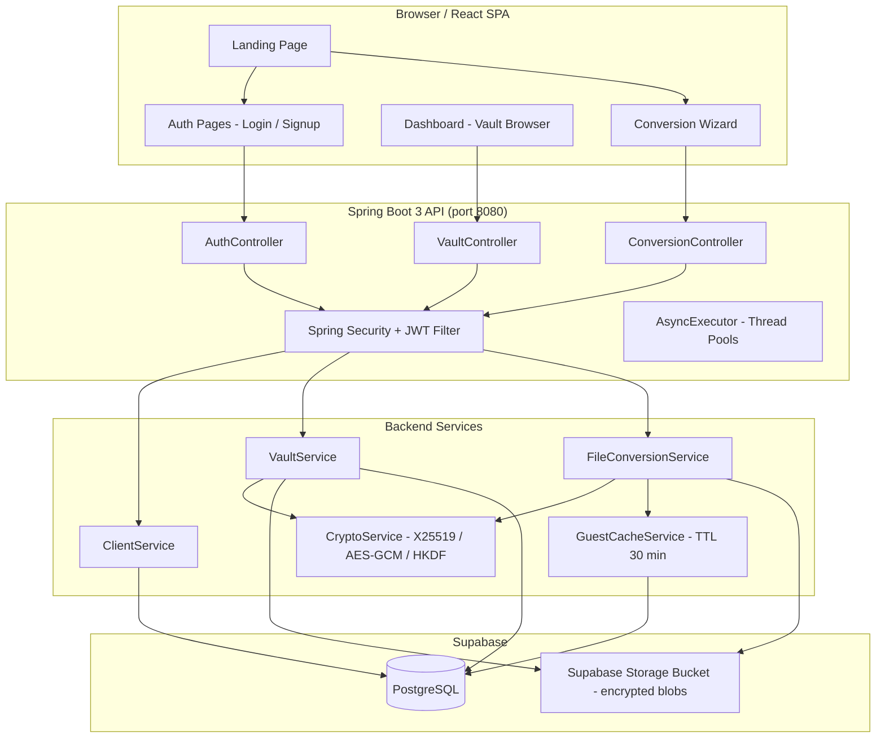
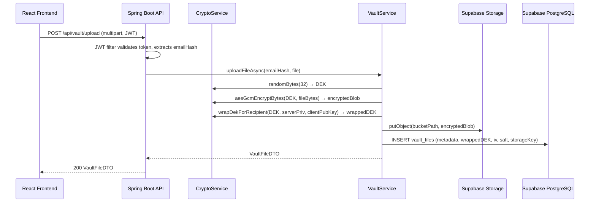
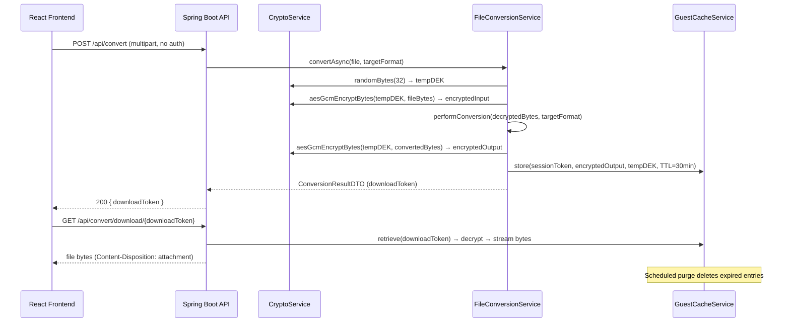

# Design Document: Secure Cloud Vault

## Overview

Secure Cloud Vault is an evolution of the existing Key Management System into a full-featured, encrypted cloud storage and file conversion platform. Authenticated users get a personal encrypted vault with full CRUD over their files; guest users get a zero-account file conversion service where nothing is persisted beyond a short-lived encrypted cache. The existing X25519 + AES-256-GCM dual-key cryptographic model is preserved and extended to cover all stored files. The backend is Spring Boot 3 connected to Supabase (PostgreSQL); the frontend is a completely new React application with a vibrant glassmorphism/neon theme.

The system is designed around three core pillars: (1) zero-knowledge storage — the database is opaque even to the administrator because all PII is encrypted at the column level and all lookup keys are SHA-256 hashed; (2) end-to-end file encryption — every file at rest is protected by a per-file Data Encryption Key (DEK) wrapped with the client's X25519 public key so the server never holds a plaintext DEK for user files; (3) non-blocking async processing — all heavy operations (upload, encryption, conversion, download) run on dedicated thread pools via CompletableFuture / @Async so the HTTP layer is never blocked.


## Architecture

### High-Level System Diagram



### Request Flow — Authenticated File Upload



### Request Flow — Guest File Conversion




## Data Models

### Supabase / PostgreSQL Schema

All PII columns use the existing `EncryptDecryptConverter` (AES-ECB, to be upgraded to AES-GCM with a proper IV column). Lookup columns store SHA-256 hashes only — the raw value is never stored in plaintext.

#### Table: `clients`

| Column | Type | Notes |
|---|---|---|
| `id` | `BIGSERIAL PK` | Internal surrogate key |
| `name_enc` | `TEXT NOT NULL` | AES-GCM encrypted name |
| `email_enc` | `TEXT NOT NULL` | AES-GCM encrypted email |
| `email_hash` | `VARCHAR(64) UNIQUE NOT NULL` | SHA-256(lowercase(email)) — used for login lookup |
| `phone_enc` | `TEXT NOT NULL` | AES-GCM encrypted phone |
| `phone_hash` | `VARCHAR(64) UNIQUE NOT NULL` | SHA-256(phone) — used for uniqueness check |
| `password_hash` | `VARCHAR(255) NOT NULL` | BCrypt hash |
| `public_key` | `TEXT NOT NULL` | Client X25519 public key (Base64) |
| `server_public_key` | `TEXT NOT NULL` | Per-client server ephemeral public key (Base64) |
| `created_at` | `TIMESTAMPTZ` | |
| `otp_code` | `VARCHAR(10)` | Nullable, current OTP |
| `otp_expiry` | `TIMESTAMPTZ` | Nullable |

#### Table: `vault_files`

Replaces the existing `documents` table with a richer schema that supports all file types and proper key material storage.

| Column | Type | Notes |
|---|---|---|
| `id` | `UUID PK DEFAULT gen_random_uuid()` | |
| `client_id` | `BIGINT FK → clients.id` | NULL for guest files |
| `filename_enc` | `TEXT NOT NULL` | AES-GCM encrypted original filename |
| `content_type` | `VARCHAR(128) NOT NULL` | MIME type (stored plaintext — not PII) |
| `file_category` | `VARCHAR(32) NOT NULL` | DOCUMENT / IMAGE / VIDEO / AUDIO |
| `storage_key` | `TEXT NOT NULL` | Path/key in Supabase Storage bucket |
| `original_size` | `BIGINT NOT NULL` | Plaintext size in bytes |
| `encrypted_size` | `BIGINT NOT NULL` | Encrypted blob size |
| `dek_wrapped_client` | `TEXT NOT NULL` | DEK wrapped with client X25519 pub key |
| `dek_wrapped_server` | `TEXT` | DEK wrapped with server key (for server-side conversion) |
| `iv` | `VARCHAR(32) NOT NULL` | Base64 GCM IV for file content |
| `salt` | `VARCHAR(32) NOT NULL` | Base64 HKDF salt used when wrapping DEK |
| `is_guest` | `BOOLEAN NOT NULL DEFAULT false` | |
| `guest_session_token` | `VARCHAR(128)` | Opaque token for guest download |
| `expires_at` | `TIMESTAMPTZ` | NULL for user files; set for guest cache |
| `created_at` | `TIMESTAMPTZ NOT NULL DEFAULT now()` | |
| `updated_at` | `TIMESTAMPTZ NOT NULL DEFAULT now()` | |

#### Table: `encrypted_data` (preserved, unchanged)

Existing KMS encrypted key/text records remain untouched for backward compatibility.

#### Table: `conversion_jobs`

Tracks async conversion job state for both guest and authenticated users.

| Column | Type | Notes |
|---|---|---|
| `id` | `UUID PK` | |
| `client_id` | `BIGINT FK` | NULL for guest |
| `source_file_id` | `UUID FK → vault_files.id` | NULL for guest (input not persisted) |
| `result_file_id` | `UUID FK → vault_files.id` | NULL until complete |
| `source_format` | `VARCHAR(32)` | e.g. `docx` |
| `target_format` | `VARCHAR(32)` | e.g. `pdf` |
| `status` | `VARCHAR(32)` | PENDING / PROCESSING / DONE / FAILED |
| `error_message` | `TEXT` | Nullable |
| `download_token` | `VARCHAR(128) UNIQUE` | For guest one-time download |
| `created_at` | `TIMESTAMPTZ` | |
| `completed_at` | `TIMESTAMPTZ` | |

### Java Entity Models

```java
// vault_files table
@Entity
@Table(name = "vault_files")
public class VaultFile {
    @Id @GeneratedValue(strategy = GenerationType.UUID)
    private UUID id;

    @ManyToOne(fetch = FetchType.LAZY)
    @JoinColumn(name = "client_id")
    private Client owner;                  // null for guests

    @Convert(converter = EncryptDecryptConverter.class)
    @Column(name = "filename_enc", nullable = false)
    private String filename;

    @Column(name = "content_type", nullable = false)
    private String contentType;

    @Enumerated(EnumType.STRING)
    @Column(name = "file_category", nullable = false)
    private FileCategory category;         // DOCUMENT, IMAGE, VIDEO, AUDIO

    @Column(name = "storage_key", nullable = false)
    private String storageKey;             // path in Supabase Storage

    private long originalSize;
    private long encryptedSize;

    @Column(name = "dek_wrapped_client", nullable = false)
    private String dekWrappedClient;       // DEK wrapped with client X25519 pub key

    @Column(name = "dek_wrapped_server")
    private String dekWrappedServer;       // DEK wrapped with server key (conversion use)

    @Column(nullable = false)
    private String iv;                     // Base64 GCM IV

    @Column(nullable = false)
    private String salt;                   // Base64 HKDF salt

    @Column(name = "is_guest", nullable = false)
    private boolean guest;

    @Column(name = "guest_session_token")
    private String guestSessionToken;

    @Column(name = "expires_at")
    private LocalDateTime expiresAt;

    private LocalDateTime createdAt;
    private LocalDateTime updatedAt;
}

// Enum for file categories
public enum FileCategory {
    DOCUMENT, IMAGE, VIDEO, AUDIO
}

// conversion_jobs table
@Entity
@Table(name = "conversion_jobs")
public class ConversionJob {
    @Id @GeneratedValue(strategy = GenerationType.UUID)
    private UUID id;

    @ManyToOne(fetch = FetchType.LAZY)
    @JoinColumn(name = "client_id")
    private Client client;

    @ManyToOne(fetch = FetchType.LAZY)
    @JoinColumn(name = "source_file_id")
    private VaultFile sourceFile;

    @ManyToOne(fetch = FetchType.LAZY)
    @JoinColumn(name = "result_file_id")
    private VaultFile resultFile;

    private String sourceFormat;
    private String targetFormat;

    @Enumerated(EnumType.STRING)
    private JobStatus status;              // PENDING, PROCESSING, DONE, FAILED

    private String errorMessage;
    private String downloadToken;          // guest one-time download token
    private LocalDateTime createdAt;
    private LocalDateTime completedAt;
}

public enum JobStatus { PENDING, PROCESSING, DONE, FAILED }
```


## Components and Interfaces

### Backend Service Layer

#### VaultService

Handles all CRUD operations for authenticated users' encrypted files.

```java
public interface VaultService {

    // Upload: encrypt file, store blob in Supabase Storage, persist metadata
    CompletableFuture<VaultFileDTO> uploadFileAsync(String emailHash,
                                                     MultipartFile file) throws Exception;

    // List all files for a user (metadata only, no blob)
    List<VaultFileDTO> listFiles(String emailHash);

    // Download: fetch encrypted blob, decrypt, stream to caller
    CompletableFuture<byte[]> downloadFileAsync(String emailHash, UUID fileId) throws Exception;

    // Rename a file (updates encrypted filename column)
    VaultFileDTO renameFile(String emailHash, UUID fileId, String newName);

    // Replace file content (re-encrypt with new DEK, update blob)
    CompletableFuture<VaultFileDTO> replaceFileAsync(String emailHash,
                                                      UUID fileId,
                                                      MultipartFile newFile) throws Exception;

    // Delete file: remove blob from Supabase Storage + DB row
    void deleteFile(String emailHash, UUID fileId);
}
```

#### FileConversionService

Handles format conversion for both guest and authenticated users.

```java
public interface FileConversionService {

    // Authenticated: convert and save result to user's vault
    CompletableFuture<ConversionJobDTO> convertAndStoreAsync(String emailHash,
                                                              UUID sourceFileId,
                                                              String targetFormat) throws Exception;

    // Guest: convert in memory, cache encrypted result, return download token
    CompletableFuture<ConversionJobDTO> convertGuestAsync(MultipartFile file,
                                                           String targetFormat) throws Exception;

    // Poll job status
    ConversionJobDTO getJobStatus(UUID jobId);

    // One-time download for guest result (invalidates token after use)
    byte[] downloadGuestResult(String downloadToken) throws Exception;
}
```

#### SupabaseStorageService

Abstracts Supabase Storage bucket operations.

```java
public interface SupabaseStorageService {

    // Upload encrypted bytes to bucket, returns storage key (path)
    String putObject(String bucket, String objectKey, byte[] encryptedBytes, String contentType);

    // Download encrypted bytes by storage key
    byte[] getObject(String bucket, String objectKey);

    // Delete object
    void deleteObject(String bucket, String objectKey);
}
```

#### GuestCacheService

Manages short-lived encrypted conversion results for guest users.

```java
public interface GuestCacheService {

    // Store encrypted result with TTL; returns opaque download token
    String store(byte[] encryptedBytes, byte[] tempDek, String iv, Duration ttl);

    // Retrieve and decrypt; throws if expired or already consumed
    byte[] retrieveAndConsume(String downloadToken) throws Exception;

    // Scheduled cleanup (every 5 minutes)
    void purgeExpired();
}
```

#### CryptoService (extended — existing class preserved)

New methods added alongside existing ones:

```java
// Existing methods preserved:
// generateX25519KeyPair(), getServerPublicKeyBase64(), computeSharedSecret()
// hkdf(), deriveKey(), aesGcmEncryptBytes(), aesGcmDecryptBytes()
// encryptAndSplit(), wrapDekForRecipient(), unwrapDek(), randomBytes()

// New additions:
public interface CryptoServiceExtensions {

    // Upgrade EncryptDecryptConverter to AES-GCM (new column-level encryption)
    // Returns Base64(iv || ciphertext)
    String encryptColumnValue(String plaintext) throws Exception;
    String decryptColumnValue(String encryptedBase64) throws Exception;

    // Derive a stable per-client KEK from the server master key + client emailHash
    // Used to wrap DEKs for server-side conversion access
    byte[] deriveServerKek(String emailHash) throws Exception;
}
```

### Backend Controllers

#### VaultController

```java
@RestController
@RequestMapping("/api/vault")
public class VaultController {

    @PostMapping("/upload")                          // multipart/form-data
    CompletableFuture<ResponseEntity<VaultFileDTO>> upload(
            @RequestParam MultipartFile file,
            @AuthenticationPrincipal UserDetails user);

    @GetMapping("/files")                            // list metadata
    ResponseEntity<List<VaultFileDTO>> listFiles(
            @AuthenticationPrincipal UserDetails user);

    @GetMapping("/files/{id}/download")              // stream decrypted bytes
    CompletableFuture<ResponseEntity<Resource>> download(
            @PathVariable UUID id,
            @AuthenticationPrincipal UserDetails user);

    @PatchMapping("/files/{id}/rename")              // rename
    ResponseEntity<VaultFileDTO> rename(
            @PathVariable UUID id,
            @RequestBody RenameRequest req,
            @AuthenticationPrincipal UserDetails user);

    @PutMapping("/files/{id}/replace")               // replace content
    CompletableFuture<ResponseEntity<VaultFileDTO>> replace(
            @PathVariable UUID id,
            @RequestParam MultipartFile file,
            @AuthenticationPrincipal UserDetails user);

    @DeleteMapping("/files/{id}")                    // delete
    ResponseEntity<Void> delete(
            @PathVariable UUID id,
            @AuthenticationPrincipal UserDetails user);
}
```

#### ConversionController

```java
@RestController
@RequestMapping("/api/convert")
public class ConversionController {

    // Authenticated: convert file already in vault
    @PostMapping("/vault/{sourceFileId}")
    CompletableFuture<ResponseEntity<ConversionJobDTO>> convertVaultFile(
            @PathVariable UUID sourceFileId,
            @RequestParam String targetFormat,
            @AuthenticationPrincipal UserDetails user);

    // Guest or authenticated: upload + convert in one shot
    @PostMapping
    CompletableFuture<ResponseEntity<ConversionJobDTO>> convertUpload(
            @RequestParam MultipartFile file,
            @RequestParam String targetFormat,
            @AuthenticationPrincipal(errorOnInvalidType = false) UserDetails user);

    // Poll job status
    @GetMapping("/jobs/{jobId}")
    ResponseEntity<ConversionJobDTO> jobStatus(@PathVariable UUID jobId);

    // Guest one-time download
    @GetMapping("/download/{token}")
    ResponseEntity<Resource> guestDownload(@PathVariable String token);
}
```

### DTOs

```java
public record VaultFileDTO(
    UUID id,
    String filename,
    String contentType,
    FileCategory category,
    long originalSize,
    LocalDateTime createdAt,
    LocalDateTime updatedAt
) {}

public record ConversionJobDTO(
    UUID jobId,
    JobStatus status,
    String sourceFormat,
    String targetFormat,
    String downloadToken,   // non-null only for guest DONE jobs
    UUID resultFileId,      // non-null only for authenticated DONE jobs
    String errorMessage
) {}

public record RenameRequest(String newName) {}
```


## Encryption & Key Management Strategy

### DB Opacity Model

The goal is that an admin with direct DB access cannot identify any user or their data.

| Data | Storage Strategy |
|---|---|
| Email | AES-256-GCM encrypted (`email_enc`); SHA-256 hash in `email_hash` for lookup |
| Phone | AES-256-GCM encrypted (`phone_enc`); SHA-256 hash in `phone_hash` for uniqueness |
| Name | AES-256-GCM encrypted (`name_enc`) |
| Password | BCrypt (cost 12) — never stored plaintext |
| Filename | AES-256-GCM encrypted (`filename_enc`) |
| File content | AES-256-GCM with per-file random DEK; DEK wrapped with X25519 |
| Client public key | Stored plaintext (it's a public key by definition) |

The existing `EncryptDecryptConverter` uses AES-ECB (no IV) which is deterministic and leaks patterns. The upgrade path is to replace it with an AES-GCM converter that prepends a random 12-byte IV to each encrypted value. This is a migration concern tracked in requirements.

### Dual-Key File Encryption (Preserved from KMS)

```
For each uploaded file:

1. Generate random 32-byte DEK
2. Encrypt file bytes:   encryptedBlob = AES-256-GCM(DEK, fileBytes)  → iv + ciphertext
3. Wrap DEK for client:  dekWrappedClient = AES-256-GCM(KEK_client, DEK)
   where KEK_client = HKDF(sharedSecret_client, salt, info)
   and   sharedSecret_client = X25519(serverPriv, clientPub)
4. Wrap DEK for server:  dekWrappedServer = AES-256-GCM(KEK_server, DEK)
   where KEK_server = HKDF(masterServerKey, salt, "server-conversion|emailHash")
   (allows server to perform conversion without client involvement)
5. Store: encryptedBlob → Supabase Storage
          dekWrappedClient, dekWrappedServer, iv, salt → vault_files table
```

For **guest files**, only `dekWrappedServer` is stored (no client key exists). The guest cache entry is purged after 30 minutes.

### HKDF Info Strings

Consistent info strings prevent cross-context key reuse:

| Context | Info String |
|---|---|
| Client DEK wrap | `"VAULT-v1\|dek-wrap\|client\|emailHash:{hash}"` |
| Server DEK wrap | `"VAULT-v1\|dek-wrap\|server\|emailHash:{hash}"` |
| Guest DEK wrap | `"VAULT-v1\|dek-wrap\|guest\|sessionToken:{token}"` |
| Column encryption KEK | `"VAULT-v1\|column-enc\|master"` |


## Async / Multithreading Strategy

All I/O-bound and CPU-bound heavy operations run off the HTTP request thread using Spring's `@Async` and `CompletableFuture`.

### Thread Pool Configuration

```java
@Configuration
@EnableAsync
public class AsyncConfig {

    // For file upload / download (I/O bound — larger pool)
    @Bean("fileIoExecutor")
    public Executor fileIoExecutor() {
        ThreadPoolTaskExecutor exec = new ThreadPoolTaskExecutor();
        exec.setCorePoolSize(10);
        exec.setMaxPoolSize(50);
        exec.setQueueCapacity(200);
        exec.setThreadNamePrefix("file-io-");
        exec.initialize();
        return exec;
    }

    // For encryption / conversion (CPU bound — bounded pool)
    @Bean("cryptoExecutor")
    public Executor cryptoExecutor() {
        ThreadPoolTaskExecutor exec = new ThreadPoolTaskExecutor();
        exec.setCorePoolSize(4);
        exec.setMaxPoolSize(Runtime.getRuntime().availableProcessors() * 2);
        exec.setQueueCapacity(100);
        exec.setThreadNamePrefix("crypto-");
        exec.initialize();
        return exec;
    }
}
```

### Async Operation Pattern

```java
// VaultService upload — pipeline: encrypt (crypto pool) then store (io pool)
@Async("cryptoExecutor")
public CompletableFuture<CryptoService.EncryptResult> encryptFileAsync(byte[] bytes, byte[] dek) {
    return CompletableFuture.completedFuture(cryptoService.encryptAndSplit(dek, bytes));
}

@Async("fileIoExecutor")
public CompletableFuture<String> storeToSupabaseAsync(String bucket, String key,
                                                        byte[] encryptedBytes,
                                                        String contentType) {
    return CompletableFuture.completedFuture(
        supabaseStorageService.putObject(bucket, key, encryptedBytes, contentType)
    );
}

// Composed pipeline in VaultService.uploadFileAsync:
public CompletableFuture<VaultFileDTO> uploadFileAsync(String emailHash, MultipartFile file) {
    byte[] dek = cryptoService.randomBytes(32);
    byte[] fileBytes = file.getBytes();

    return encryptFileAsync(fileBytes, dek)
        .thenComposeAsync(encResult -> {
            String objectKey = "vault/" + emailHash + "/" + UUID.randomUUID();
            return storeToSupabaseAsync(BUCKET, objectKey,
                Base64.getDecoder().decode(encResult.getCiphertextBase64()),
                file.getContentType())
            .thenApplyAsync(storageKey -> {
                // wrap DEK, persist metadata, return DTO
                return persistMetadataAndBuildDTO(emailHash, file, encResult,
                                                   storageKey, dek);
            }, fileIoExecutor);
        }, cryptoExecutor);
}
```

### Conversion Job Lifecycle

```
POST /api/convert  →  create ConversionJob(PENDING)  →  return jobId immediately
                   →  submit to cryptoExecutor async
                   →  PROCESSING: decrypt source → convert → encrypt result → store
                   →  DONE: update job, set resultFileId or downloadToken
                   →  client polls GET /api/convert/jobs/{jobId} until DONE or FAILED
```


## File Conversion Support Matrix

### Conversion Engine Selection

| Category | Conversion | Library |
|---|---|---|
| Document | DOCX → PDF | docx4j (already in pom.xml) |
| Document | PDF → DOCX | Apache PDFBox + POI |
| Document | CSV ↔ XLSX | Apache POI |
| Document | TXT → PDF | iText / OpenPDF |
| Image | JPG ↔ PNG ↔ WEBP ↔ BMP | Java ImageIO + TwelveMonkeys ImageIO plugins |
| Audio | MP3 ↔ WAV ↔ FLAC ↔ AAC ↔ OGG | JAVE2 (Java Audio Video Encoder — wraps FFmpeg) |
| Video | MP4 ↔ AVI ↔ MOV ↔ MKV | JAVE2 (FFmpeg wrapper) |

### FileConversionService Algorithm

```pascal
PROCEDURE convertFile(inputBytes, sourceFormat, targetFormat)
  INPUT: inputBytes: byte[], sourceFormat: String, targetFormat: String
  OUTPUT: convertedBytes: byte[]

  SEQUENCE
    category ← detectCategory(sourceFormat)

    IF category = DOCUMENT THEN
      RETURN convertDocument(inputBytes, sourceFormat, targetFormat)
    ELSE IF category = IMAGE THEN
      RETURN convertImage(inputBytes, sourceFormat, targetFormat)
    ELSE IF category = AUDIO THEN
      RETURN convertAudio(inputBytes, sourceFormat, targetFormat)
    ELSE IF category = VIDEO THEN
      RETURN convertVideo(inputBytes, sourceFormat, targetFormat)
    ELSE
      THROW UnsupportedConversionException(sourceFormat + " → " + targetFormat)
    END IF
  END SEQUENCE
END PROCEDURE

PROCEDURE convertDocument(inputBytes, sourceFormat, targetFormat)
  SEQUENCE
    IF sourceFormat = "docx" AND targetFormat = "pdf" THEN
      pkg ← WordprocessingMLPackage.load(new ByteArrayInputStream(inputBytes))
      RETURN Docx4J.toPDF(pkg)
    ELSE IF sourceFormat = "csv" AND targetFormat = "xlsx" THEN
      RETURN CsvToXlsxConverter.convert(inputBytes)
    ELSE IF sourceFormat = "xlsx" AND targetFormat = "csv" THEN
      RETURN XlsxToCsvConverter.convert(inputBytes)
    ELSE IF sourceFormat = "txt" AND targetFormat = "pdf" THEN
      RETURN TxtToPdfConverter.convert(inputBytes)
    ELSE
      THROW UnsupportedConversionException(...)
    END IF
  END SEQUENCE
END PROCEDURE
```

### Supported MIME Types → FileCategory Mapping

```java
public enum FileCategory {
    DOCUMENT, IMAGE, VIDEO, AUDIO;

    private static final Map<String, FileCategory> MIME_MAP = Map.ofEntries(
        // Documents
        entry("application/pdf", DOCUMENT),
        entry("application/vnd.openxmlformats-officedocument.wordprocessingml.document", DOCUMENT),
        entry("application/msword", DOCUMENT),
        entry("text/plain", DOCUMENT),
        entry("text/csv", DOCUMENT),
        entry("application/vnd.openxmlformats-officedocument.spreadsheetml.sheet", DOCUMENT),
        // Images
        entry("image/jpeg", IMAGE), entry("image/png", IMAGE),
        entry("image/webp", IMAGE), entry("image/gif", IMAGE), entry("image/bmp", IMAGE),
        // Audio
        entry("audio/mpeg", AUDIO), entry("audio/wav", AUDIO),
        entry("audio/flac", AUDIO), entry("audio/aac", AUDIO), entry("audio/ogg", AUDIO),
        // Video
        entry("video/mp4", VIDEO), entry("video/x-msvideo", VIDEO),
        entry("video/quicktime", VIDEO), entry("video/x-matroska", VIDEO)
    );

    public static FileCategory fromMimeType(String mimeType) {
        return Optional.ofNullable(MIME_MAP.get(mimeType.toLowerCase()))
            .orElseThrow(() -> new UnsupportedFileTypeException(mimeType));
    }
}
```


## Supabase Integration

### Database Connection

Replace the H2 in-memory datasource with Supabase's PostgreSQL connection string.

```yaml
# application.yml (production profile)
spring:
  datasource:
    url: jdbc:postgresql://${SUPABASE_DB_HOST}:5432/postgres
    username: postgres
    password: ${SUPABASE_DB_PASSWORD}
    driver-class-name: org.postgresql.Driver
  jpa:
    hibernate:
      ddl-auto: validate          # use Flyway/Liquibase for migrations in prod
    database-platform: org.hibernate.dialect.PostgreSQLDialect
    show-sql: false

supabase:
  url: ${SUPABASE_URL}
  anon-key: ${SUPABASE_ANON_KEY}
  service-role-key: ${SUPABASE_SERVICE_ROLE_KEY}
  storage:
    bucket: vault-files
```

### Supabase Storage Client

Supabase Storage is accessed via its REST API. The `SupabaseStorageService` implementation uses Spring's `RestTemplate` or `WebClient` with the service-role key for server-to-server calls.

```java
@Service
public class SupabaseStorageServiceImpl implements SupabaseStorageService {

    private final WebClient webClient;
    private final String bucket;

    // PUT /storage/v1/object/{bucket}/{objectKey}
    public String putObject(String bucket, String objectKey,
                             byte[] encryptedBytes, String contentType) {
        webClient.put()
            .uri("/storage/v1/object/{bucket}/{key}", bucket, objectKey)
            .header("Authorization", "Bearer " + serviceRoleKey)
            .header("Content-Type", contentType)
            .bodyValue(encryptedBytes)
            .retrieve()
            .toBodilessEntity()
            .block();
        return objectKey;
    }

    // GET /storage/v1/object/{bucket}/{objectKey}
    public byte[] getObject(String bucket, String objectKey) {
        return webClient.get()
            .uri("/storage/v1/object/{bucket}/{key}", bucket, objectKey)
            .header("Authorization", "Bearer " + serviceRoleKey)
            .retrieve()
            .bodyToMono(byte[].class)
            .block();
    }

    // DELETE /storage/v1/object/{bucket}/{objectKey}
    public void deleteObject(String bucket, String objectKey) {
        webClient.delete()
            .uri("/storage/v1/object/{bucket}/{key}", bucket, objectKey)
            .header("Authorization", "Bearer " + serviceRoleKey)
            .retrieve()
            .toBodilessEntity()
            .block();
    }
}
```

### Required Maven Dependencies (additions to pom.xml)

```xml
<!-- PostgreSQL driver -->
<dependency>
    <groupId>org.postgresql</groupId>
    <artifactId>postgresql</artifactId>
    <scope>runtime</scope>
</dependency>

<!-- Spring WebFlux (for WebClient to call Supabase Storage REST API) -->
<dependency>
    <groupId>org.springframework.boot</groupId>
    <artifactId>spring-boot-starter-webflux</artifactId>
</dependency>

<!-- Apache POI (CSV/XLSX conversion) -->
<dependency>
    <groupId>org.apache.poi</groupId>
    <artifactId>poi-ooxml</artifactId>
    <version>5.2.5</version>
</dependency>

<!-- Apache PDFBox (PDF → DOCX) -->
<dependency>
    <groupId>org.apache.pdfbox</groupId>
    <artifactId>pdfbox</artifactId>
    <version>3.0.1</version>
</dependency>

<!-- OpenPDF (TXT → PDF) -->
<dependency>
    <groupId>com.github.librepdf</groupId>
    <artifactId>openpdf</artifactId>
    <version>1.3.30</version>
</dependency>

<!-- TwelveMonkeys ImageIO (WEBP, BMP support) -->
<dependency>
    <groupId>com.twelvemonkeys.imageio</groupId>
    <artifactId>imageio-webp</artifactId>
    <version>3.10.1</version>
</dependency>

<!-- JAVE2 (audio/video conversion via FFmpeg) -->
<dependency>
    <groupId>ws.schild</groupId>
    <artifactId>jave-all-deps</artifactId>
    <version>3.3.1</version>
</dependency>

<!-- Flyway (DB migrations) -->
<dependency>
    <groupId>org.flywaydb</groupId>
    <artifactId>flyway-core</artifactId>
</dependency>
```


## API Design

### Authentication Endpoints (existing, preserved)

| Method | Path | Auth | Description |
|---|---|---|---|
| POST | `/api/clients/register` | None | Register new user |
| POST | `/api/clients/login` | None | Login, returns JWT |
| POST | `/api/otp/send` | None | Send OTP to email |
| POST | `/api/otp/verify` | None | Verify OTP |

### Vault Endpoints (new)

| Method | Path | Auth | Description |
|---|---|---|---|
| POST | `/api/vault/upload` | JWT | Upload + encrypt file to vault |
| GET | `/api/vault/files` | JWT | List vault files (metadata) |
| GET | `/api/vault/files/{id}/download` | JWT | Download + decrypt file |
| PATCH | `/api/vault/files/{id}/rename` | JWT | Rename file |
| PUT | `/api/vault/files/{id}/replace` | JWT | Replace file content |
| DELETE | `/api/vault/files/{id}` | JWT | Delete file |

### Conversion Endpoints (new)

| Method | Path | Auth | Description |
|---|---|---|---|
| POST | `/api/convert` | Optional | Upload + convert (guest or auth) |
| POST | `/api/convert/vault/{sourceFileId}` | JWT | Convert vault file |
| GET | `/api/convert/jobs/{jobId}` | Optional | Poll job status |
| GET | `/api/convert/download/{token}` | None | Guest one-time download |

### Server Public Key Endpoint (existing, preserved)

| Method | Path | Auth | Description |
|---|---|---|---|
| GET | `/api/clients/server-public-key` | None | Get server X25519 public key |

### Error Response Format

```json
{
  "timestamp": "2024-01-15T10:30:00Z",
  "status": 400,
  "error": "Bad Request",
  "message": "File type not supported: video/x-flv",
  "path": "/api/convert"
}
```


## Frontend Architecture

### Technology Stack

- React 18 + TypeScript
- Vite (replaces CRA)
- React Router v6
- Zustand (lightweight state management — auth state, vault state)
- React Query (TanStack Query v5) — server state, caching, polling for conversion jobs
- Axios — HTTP client with JWT interceptor
- Framer Motion — animations
- CSS Modules + custom design tokens (no Material-UI)

### Page Structure

```
kms-frontend/src/
├── pages/
│   ├── LandingPage.tsx          # Hero, CTAs, feature highlights
│   ├── LoginPage.tsx
│   ├── SignupPage.tsx
│   ├── DashboardPage.tsx        # Vault browser
│   └── ConvertPage.tsx          # Conversion wizard (guest + auth)
├── components/
│   ├── layout/
│   │   ├── Navbar.tsx
│   │   └── PageShell.tsx        # Glassmorphism card wrapper
│   ├── vault/
│   │   ├── FileGrid.tsx         # Masonry/grid of vault files
│   │   ├── FileCard.tsx         # Individual file card with actions
│   │   ├── UploadDropzone.tsx   # Drag-and-drop upload area
│   │   └── FilePreviewModal.tsx # In-browser preview (images, PDFs)
│   ├── convert/
│   │   ├── ConversionWizard.tsx # Step 1: upload, Step 2: pick format, Step 3: download
│   │   ├── FormatSelector.tsx
│   │   └── ConversionProgress.tsx # Animated progress, polls job status
│   └── ui/
│       ├── Button.tsx
│       ├── Input.tsx
│       ├── Modal.tsx
│       └── Toast.tsx
├── hooks/
│   ├── useAuth.ts               # Zustand auth store + login/logout actions
│   ├── useVault.ts              # React Query hooks for vault CRUD
│   └── useConversion.ts         # React Query hooks for conversion + polling
├── services/
│   ├── api.ts                   # Axios instance with JWT interceptor
│   ├── vaultApi.ts
│   └── conversionApi.ts
└── styles/
    ├── tokens.css               # Design tokens (colors, spacing, radii)
    └── global.css
```

### Visual Theme

The theme is built around a dark base with neon accent colors and glassmorphism surfaces. No Material-UI defaults.

```css
/* styles/tokens.css */
:root {
  /* Base */
  --color-bg:           #0a0a0f;
  --color-surface:      rgba(255, 255, 255, 0.05);
  --color-surface-hover: rgba(255, 255, 255, 0.09);
  --color-border:       rgba(255, 255, 255, 0.12);

  /* Neon accents */
  --color-primary:      #7c3aed;   /* electric violet */
  --color-primary-glow: rgba(124, 58, 237, 0.4);
  --color-accent:       #06b6d4;   /* cyan */
  --color-accent-glow:  rgba(6, 182, 212, 0.35);
  --color-success:      #10b981;
  --color-danger:       #ef4444;
  --color-warning:      #f59e0b;

  /* Text */
  --color-text:         #f1f5f9;
  --color-text-muted:   #94a3b8;

  /* Glassmorphism card */
  --glass-bg:           rgba(255, 255, 255, 0.04);
  --glass-border:       1px solid rgba(255, 255, 255, 0.10);
  --glass-blur:         blur(16px);
  --glass-shadow:       0 8px 32px rgba(0, 0, 0, 0.4);

  /* Gradients */
  --gradient-hero:      linear-gradient(135deg, #7c3aed 0%, #06b6d4 100%);
  --gradient-card:      linear-gradient(145deg, rgba(124,58,237,0.15), rgba(6,182,212,0.08));

  /* Spacing & radii */
  --radius-sm:  8px;
  --radius-md:  16px;
  --radius-lg:  24px;
  --radius-xl:  32px;
}

.glass-card {
  background: var(--glass-bg);
  border: var(--glass-border);
  backdrop-filter: var(--glass-blur);
  box-shadow: var(--glass-shadow);
  border-radius: var(--radius-lg);
}
```

### Landing Page CTAs

```tsx
// LandingPage.tsx — key structure
<section className={styles.hero}>
  <h1>Your files. <span className={styles.gradient}>Encrypted.</span> Yours.</h1>
  <p>Zero-knowledge cloud storage with military-grade encryption.
     Convert files without an account.</p>
  <div className={styles.ctaGroup}>
    <Button variant="primary" size="lg" onClick={() => navigate('/signup')}>
      Store My Files
    </Button>
    <Button variant="ghost" size="lg" onClick={() => navigate('/convert')}>
      Convert a File — No Login Needed
    </Button>
  </div>
</section>
```

### Conversion Wizard Flow

```
Step 1: Drop or select file
        ↓ (file selected)
Step 2: Choose target format
        (only compatible formats shown based on source MIME type)
        ↓ (format selected, click Convert)
Step 3: Animated progress bar
        (polls GET /api/convert/jobs/{jobId} every 2 seconds)
        ↓ (status = DONE)
Step 4: Download button appears
        If authenticated: "Save to Vault" button also appears
        ↓ (download clicked)
        GET /api/convert/download/{token}  →  file download
```

### Auth State (Zustand)

```typescript
interface AuthState {
  token: string | null;
  emailHash: string | null;
  isAuthenticated: boolean;
  login: (token: string, emailHash: string) => void;
  logout: () => void;
}
```


## Low-Level Design: Key Algorithms

### Upload Algorithm (Authenticated)

```pascal
ALGORITHM uploadFile(emailHash, multipartFile)
INPUT:  emailHash: String, multipartFile: MultipartFile
OUTPUT: VaultFileDTO

PRECONDITIONS:
  - emailHash is a valid SHA-256 hex string
  - multipartFile.size ≤ MAX_FILE_SIZE (configurable, default 500MB)
  - multipartFile.contentType is in SUPPORTED_MIME_TYPES

POSTCONDITIONS:
  - Encrypted blob stored in Supabase Storage at vault/{emailHash}/{uuid}
  - vault_files row inserted with dekWrappedClient, dekWrappedServer, iv, salt
  - Returned DTO contains no key material

BEGIN
  fileBytes    ← multipartFile.getBytes()
  dek          ← secureRandom(32)                          // random DEK
  encResult    ← AES_GCM_ENCRYPT(dek, fileBytes)           // iv || ciphertext
  objectKey    ← "vault/" + emailHash + "/" + randomUUID()

  // Wrap DEK for client (client can decrypt their own files)
  client       ← clientRepository.findByEmailHash(emailHash)
  salt         ← secureRandom(16)
  infoClient   ← "VAULT-v1|dek-wrap|client|emailHash:" + emailHash
  kekClient    ← HKDF(salt, X25519(serverPriv, clientPub), infoClient, 32)
  dekWrappedC  ← AES_GCM_ENCRYPT(kekClient, dek)

  // Wrap DEK for server (server can decrypt for conversion)
  infoServer   ← "VAULT-v1|dek-wrap|server|emailHash:" + emailHash
  kekServer    ← HKDF(salt, masterServerKey, infoServer, 32)
  dekWrappedS  ← AES_GCM_ENCRYPT(kekServer, dek)

  // Store blob (async, fileIoExecutor)
  supabaseStorage.putObject(BUCKET, objectKey, encResult.ciphertext, contentType)

  // Persist metadata (async, fileIoExecutor)
  vaultFile    ← new VaultFile(
    owner        = client,
    filename     = ENCRYPT_COLUMN(multipartFile.originalFilename),
    contentType  = multipartFile.contentType,
    category     = FileCategory.fromMimeType(contentType),
    storageKey   = objectKey,
    originalSize = fileBytes.length,
    encryptedSize = encResult.ciphertext.length,
    dekWrappedClient = BASE64(dekWrappedC),
    dekWrappedServer = BASE64(dekWrappedS),
    iv           = BASE64(encResult.iv),
    salt         = BASE64(salt),
    guest        = false
  )
  saved ← vaultFileRepository.save(vaultFile)

  ASSERT saved.id IS NOT NULL
  ASSERT saved.storageKey = objectKey

  RETURN VaultFileDTO.from(saved)
END

LOOP INVARIANTS: N/A (no loops in main path)
```

### Download Algorithm (Authenticated)

```pascal
ALGORITHM downloadFile(emailHash, fileId)
INPUT:  emailHash: String, fileId: UUID
OUTPUT: byte[] (plaintext file bytes)

PRECONDITIONS:
  - vault_files row with fileId exists AND owner.emailHash = emailHash
  - dekWrappedClient is non-null

POSTCONDITIONS:
  - Returned bytes are the original plaintext file bytes
  - No key material is returned or logged

BEGIN
  vaultFile    ← vaultFileRepository.findByIdAndOwnerEmailHash(fileId, emailHash)
                 OR THROW 404

  // Fetch encrypted blob from Supabase Storage (async, fileIoExecutor)
  encryptedBlob ← supabaseStorage.getObject(BUCKET, vaultFile.storageKey)

  // Unwrap DEK using client's X25519 key
  client       ← vaultFile.owner
  salt         ← BASE64_DECODE(vaultFile.salt)
  infoClient   ← "VAULT-v1|dek-wrap|client|emailHash:" + emailHash
  kekClient    ← HKDF(salt, X25519(serverPriv, clientPub), infoClient, 32)
  dek          ← AES_GCM_DECRYPT(kekClient, BASE64_DECODE(vaultFile.dekWrappedClient))

  // Decrypt blob
  iv           ← BASE64_DECODE(vaultFile.iv)
  plaintext    ← AES_GCM_DECRYPT(dek, iv || encryptedBlob)

  ASSERT plaintext.length = vaultFile.originalSize

  RETURN plaintext
END
```

### Guest Conversion Algorithm

```pascal
ALGORITHM convertGuest(multipartFile, targetFormat)
INPUT:  multipartFile: MultipartFile, targetFormat: String
OUTPUT: ConversionJobDTO (with downloadToken)

PRECONDITIONS:
  - multipartFile.contentType is in SUPPORTED_MIME_TYPES
  - targetFormat is compatible with source format

POSTCONDITIONS:
  - No file data persisted beyond TTL=30min encrypted cache
  - downloadToken is a cryptographically random opaque string
  - ConversionJob row created with status=PENDING, updated to DONE or FAILED

BEGIN
  job          ← conversionJobRepository.save(new ConversionJob(PENDING))
  sessionToken ← secureRandomHex(32)

  // Submit async to cryptoExecutor
  ASYNC DO
    TRY
      job.status ← PROCESSING
      conversionJobRepository.save(job)

      // Encrypt input in memory (never written to disk unencrypted)
      tempDek      ← secureRandom(32)
      encInput     ← AES_GCM_ENCRYPT(tempDek, multipartFile.getBytes())

      // Convert
      plainInput   ← multipartFile.getBytes()
      converted    ← fileConversionService.convert(plainInput,
                       sourceFormat, targetFormat)

      // Encrypt output
      encOutput    ← AES_GCM_ENCRYPT(tempDek, converted)

      // Cache with TTL
      downloadToken ← guestCacheService.store(encOutput, tempDek,
                        encOutput.iv, Duration.ofMinutes(30))

      job.status        ← DONE
      job.downloadToken ← downloadToken
      job.completedAt   ← now()
      conversionJobRepository.save(job)

    CATCH Exception e
      job.status       ← FAILED
      job.errorMessage ← e.getMessage()
      conversionJobRepository.save(job)
    END TRY
  END ASYNC

  RETURN ConversionJobDTO.from(job)
END
```

### DB Opacity: Column Encryption Upgrade

The existing `EncryptDecryptConverter` uses AES-ECB (deterministic, leaks patterns). The upgraded converter uses AES-256-GCM with a random IV prepended to each value:

```pascal
PROCEDURE encryptColumnValue(plaintext, masterKey)
  INPUT:  plaintext: String, masterKey: byte[32]
  OUTPUT: Base64(iv || ciphertext): String

  SEQUENCE
    iv         ← secureRandom(12)
    ciphertext ← AES_GCM_ENCRYPT(masterKey, iv, plaintext.getBytes(UTF-8))
    RETURN BASE64(iv || ciphertext)
  END SEQUENCE
END PROCEDURE

PROCEDURE decryptColumnValue(encryptedBase64, masterKey)
  INPUT:  encryptedBase64: String, masterKey: byte[32]
  OUTPUT: plaintext: String

  SEQUENCE
    raw        ← BASE64_DECODE(encryptedBase64)
    iv         ← raw[0..11]
    ciphertext ← raw[12..]
    plaintext  ← AES_GCM_DECRYPT(masterKey, iv, ciphertext)
    RETURN new String(plaintext, UTF-8)
  END SEQUENCE
END PROCEDURE
```

The master key is loaded from an environment variable (`VAULT_COLUMN_MASTER_KEY`, 32-byte Base64) and never hardcoded.


## Error Handling

### Error Scenarios

| Scenario | HTTP Status | Handling |
|---|---|---|
| Unsupported file type | 400 | `UnsupportedFileTypeException` → GlobalExceptionHandler |
| File too large | 413 | Spring `MaxUploadSizeExceededException` |
| File not found / wrong owner | 404 | `ResourceNotFoundException` |
| Decryption failure (bad key) | 422 | `DecryptionException` |
| Conversion failure | 500 | Job marked FAILED, error message stored |
| Guest token expired | 410 | `GuestTokenExpiredException` |
| Guest token already consumed | 410 | Same exception |
| Supabase Storage unreachable | 503 | `StorageUnavailableException` with retry |
| Concurrent upload limit exceeded | 429 | Thread pool queue full → `RejectedExecutionException` |

### GlobalExceptionHandler additions

```java
@ExceptionHandler(UnsupportedFileTypeException.class)
ResponseEntity<ErrorResponse> handleUnsupportedType(UnsupportedFileTypeException ex) {
    return ResponseEntity.badRequest().body(new ErrorResponse(400, ex.getMessage()));
}

@ExceptionHandler(GuestTokenExpiredException.class)
ResponseEntity<ErrorResponse> handleExpiredToken(GuestTokenExpiredException ex) {
    return ResponseEntity.status(410).body(new ErrorResponse(410, "Download link expired or already used"));
}

@ExceptionHandler(DecryptionException.class)
ResponseEntity<ErrorResponse> handleDecryption(DecryptionException ex) {
    return ResponseEntity.unprocessableEntity().body(new ErrorResponse(422, "Decryption failed — invalid key material"));
}
```

## Security Considerations

- **JWT secret** must be at least 256-bit random value stored in environment variable, not in `application.yml`
- **Column master key** (`VAULT_COLUMN_MASTER_KEY`) stored in environment variable / secrets manager
- **Supabase service-role key** stored in environment variable, never committed
- **File size limits** enforced at Spring (`spring.servlet.multipart.max-file-size`) and Supabase Storage level
- **Content-type validation** — server re-detects MIME type from file magic bytes (Apache Tika), not just the client-supplied header
- **Path traversal** — storage keys are always `vault/{emailHash}/{uuid}`, never derived from user-supplied filenames
- **Guest token** — 32-byte cryptographically random hex, single-use, 30-minute TTL
- **Rate limiting** — consider Spring's `bucket4j` or API Gateway rate limiting for conversion endpoint to prevent abuse
- **CORS** — restrict to known frontend origin in production (not `*`)
- **Hardcoded secrets** — the existing `EncryptDecryptConverter` has a hardcoded `"MySuperSecretKey"` that must be replaced with the environment-variable-backed master key before production deployment

## Testing Strategy

### Unit Testing

- `CryptoService`: encrypt/decrypt round-trip, HKDF determinism, DEK wrap/unwrap
- `FileConversionService`: each conversion path with sample files
- `VaultService`: mock Supabase storage, verify DEK wrapping logic
- `GuestCacheService`: TTL expiry, single-use token enforcement
- `FileCategory.fromMimeType`: all supported and unsupported MIME types

### Integration Testing

- Full upload → download round-trip via `@SpringBootTest` with Testcontainers (PostgreSQL)
- Guest conversion → download flow end-to-end
- JWT authentication filter with valid and expired tokens
- Scheduled guest file purge

### Property-Based Testing

Using `junit-quickcheck` or manual parameterized tests:
- For any plaintext byte array P and valid key K: `decrypt(encrypt(P, K), K) == P`
- For any supported (sourceFormat, targetFormat) pair: conversion produces non-empty output
- For any emailHash: `decryptColumn(encryptColumn(value)) == value`


## Performance Considerations

- **Streaming uploads/downloads** — for files > 10MB, use `StreamingResponseBody` on download and chunked multipart on upload to avoid loading entire file into heap
- **Thread pool sizing** — `fileIoExecutor` sized for I/O concurrency (10–50 threads); `cryptoExecutor` sized for CPU (2× core count)
- **Supabase Storage** — encrypted blobs are stored as-is; no server-side re-encryption by Supabase (we handle encryption before upload)
- **Conversion queue** — conversion jobs are queued; if queue is full, return 429 with `Retry-After` header
- **Guest cache** — stored in PostgreSQL `vault_files` with `is_guest=true` and `expires_at`; purged every 5 minutes by `@Scheduled` task; for high volume, consider Redis

## Dependencies Summary

### Backend (additions to existing pom.xml)

| Dependency | Purpose |
|---|---|
| `postgresql` | Supabase PostgreSQL driver |
| `spring-boot-starter-webflux` | WebClient for Supabase Storage REST API |
| `poi-ooxml` | CSV ↔ XLSX conversion |
| `pdfbox` | PDF → DOCX |
| `openpdf` | TXT → PDF |
| `imageio-webp` (TwelveMonkeys) | WEBP image support |
| `jave-all-deps` | Audio/video conversion (FFmpeg wrapper) |
| `flyway-core` | Database migrations |
| `tika-core` | MIME type detection from file magic bytes |

### Frontend (new)

| Package | Purpose |
|---|---|
| `react` + `react-dom` | UI framework |
| `typescript` | Type safety |
| `vite` | Build tool |
| `react-router-dom` | Routing |
| `zustand` | Auth state |
| `@tanstack/react-query` | Server state + polling |
| `axios` | HTTP client |
| `framer-motion` | Animations |
| `react-dropzone` | Drag-and-drop file upload |


## Correctness Properties

*A property is a characteristic or behavior that should hold true across all valid executions of a system — essentially, a formal statement about what the system should do. Properties serve as the bridge between human-readable specifications and machine-verifiable correctness guarantees.*

### Property 1: File Encryption Round-Trip

For any plaintext file byte array uploaded by an authenticated user, downloading that file must return byte-for-byte identical content to the original upload.

**Validates: Requirements 2.1, 2.6**

### Property 2: DEK Uniqueness Per File

For any two distinct file uploads (even with identical content), the generated DEK must be different, and the resulting `dek_wrapped_client` and `dek_wrapped_server` values must be distinct from each other and from those of any other file.

**Validates: Requirements 2.1, 2.2, 2.3**

### Property 3: Column Encryption Non-Determinism

For any plaintext string value, encrypting it twice with the Column_Converter must produce two different ciphertexts (due to the random 12-byte IV), while both ciphertexts must decrypt back to the original plaintext.

**Validates: Requirements 6.1, 6.2**

### Property 4: Column Encryption Round-Trip

For any string value, encrypting then decrypting with the Column_Converter must return the original string unchanged.

**Validates: Requirements 6.1, 6.2**

### Property 5: Email Hash Consistency

For any email address, SHA-256(lowercase(email)) computed at registration time must equal SHA-256(lowercase(email)) computed at login time, ensuring the lookup always succeeds for valid credentials.

**Validates: Requirements 1.1, 6.4, 6.5**

### Property 6: Guest Token Single-Use

For any valid Download_Token, the first retrieval must succeed and return the decrypted file bytes; every subsequent retrieval with the same token must fail with HTTP 410.

**Validates: Requirements 3.5, 8.6, 8.7**

### Property 7: Guest Data Expiry

For any guest cache entry stored with a 30-minute TTL, attempting to retrieve it after the TTL has elapsed must fail; the entry must not be present in the database after the scheduled purge runs.

**Validates: Requirements 3.6, 3.7, 3.8**

### Property 8: Guest Token Uniqueness

For any two distinct guest conversion operations, the issued Download_Tokens must be different.

**Validates: Requirements 8.6**

### Property 9: Storage Key Path Safety

For any file upload regardless of the original filename, the constructed Storage_Key must match the pattern `vault/{emailHash}/{uuid}` where the UUID is server-generated and the filename does not appear in the key.

**Validates: Requirements 8.2**

### Property 10: File Category Classification

For any MIME type in the supported set, `FileCategory.fromMimeType` must return the correct FileCategory enum value; for any MIME type not in the supported set, it must throw UnsupportedFileTypeException.

**Validates: Requirements 5.9, 5.10**

### Property 11: Conversion Output Non-Empty

For any valid (sourceFormat, targetFormat) pair and non-empty input bytes, the Conversion_Service must produce a non-empty output byte array.

**Validates: Requirements 5.1, 5.2, 5.3, 5.4, 5.5, 5.6, 5.7**

### Property 12: Rename Preserves Key Material

For any vault file, renaming it must update only the `filename_enc` column; the `dek_wrapped_client`, `dek_wrapped_server`, `iv`, `salt`, and `storage_key` columns must remain unchanged.

**Validates: Requirements 2.8**

### Property 13: Replace Generates New DEK

For any vault file replacement, the new `dek_wrapped_client` and `dek_wrapped_server` values stored after the replace operation must differ from the values stored before the replace operation.

**Validates: Requirements 2.9**
